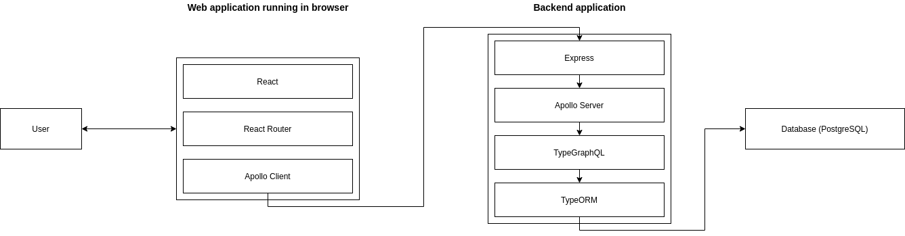

# stack

## Overview



## Devops

### Git and GitHub

Git is a version control system and is used to coordinating work among programmers and track files changes over time. GitHub is a Git repository hosting service, which adds a graphical user interface and many other features on top of git.

#### Git repository

A git repository is just folder that has a commit history, often containing code projects.

A new repository can be created but running the following command in the directory that you want to become a repository.

```sh
git init
```

Repositories can be copied, or cloned from other repositories

```sh
git clone <location of repository>
# Example
git clone https://github.com/facebook/react
```

#### Git commit

A git commit is a snapshot of the state of a git repository at a specific time, which contains information about what has changed since the last commit.

A commit can be made to a git repository with the following command

```sh
git commit -m "<your descriptive message of change that happened>"
# Example
git commit -m "Added a paragraph about git to the README file"
```

In order to include a change in a commit the change has to be added

```sh
# Add all files that are changed
git add .
# or
git add -a

# Add a single file or folder
git add README.me
# or
git add packages
```

Removing a file or folder from being included in the next commit

```sh
git reset -- README.md
# or
git reset -- packages
```

#### Git branch

A git branch is a timeline of commits. A git repository can have multiple branches, where a new branch can be created from an existing branch, creating a new timeline of commits. Old commits are shared between branches, but new commits only appear on the new timeline, not on the original branch's commit history.


To create a new branch from the current position in the current branch

```sh
# Branch names cannot contain spaces
git checkout -b <branch name>
```

To switch to another branch

```sh
# Make sure you have no changes to commit in your current branch first
git checkout <branch name>
```

#### Git merge

When working on multiple branches, eventually you'll want to add the features of one branch to another branch. The process of joining the diverging timeline of commits from one branch to another is called merging.

To merge from branch `a` to branch `b` run

```sh
git checkout b
git merge a
```

#### Git push / pull

Git push is used to push local commits to a remote repository (GitHub).

```sh
git push
# or
git push origin <branch name>
```

Git pull is used to get the latest commits from a remote repository (changes from the other developers).

```sh
git pull
```

#### Git stash

If you have changes that you don't want to commit, but don't want to lose either, git stash is your friend. Git stash is a special kind of commit, that does not appear on the commit timeline.

First add files and folder that you would like to stash and then run

```sh
git stash
```

To apply a stash, run, which applies the stash to the current state of your project.

```sh
git stash apply
```

To apply a stash and remove it from the stash list, run

```sh
git stash pop
```

To remove a stash from the list without applying it, run

```sh
git stash drop
```

#### Documentation

The documentation for Git can be found [here](https://git-scm.com/doc). An easy git guide can be found [here](https://rogerdudler.github.io/git-guide/), explaining the most basic and common commands and concepts.

### Yarn - JavaScript package management

Yarn is a JavaScript dependency manager, which allows for easily adding and removing dependencies (such as React and Express). Yarn also has a feature called `yarn workspaces`, which makes it easy to manage dependencies in a monorepo (a monorepo is a repository containing multiple applications/packages, e.g. packages/frontend and packages/backend). Running the install command anywhere within the project installs all the dependencies for all the packages in the project.

#### Usage

To install all packages listen in the various `package.json`s, run

```sh
yarn # short for yarn install
```

Add a dependency

```sh
yarn add <package names>...
# Example:
yarn add react express
```

Add a development dependency

```sh
yarn add --dev <package names>...
# or
yarn add -D <package names>...
# Example
yarn add -D @types/react
```

Remove a dependency

```sh
yarn remove <package names>...
# Example
yarn remove react express @types/react
```

Adding a dependency to the root of a monorepo project requires the use of the `-W` flag. E.g.

```sh
yarn add -W -D typescript
```

#### Documentation

The documentation for Yarn can found [here](https://classic.yarnpkg.com/en/docs/).

### Jest - JavaScript testing framework

Jest is a testing framework for JavaScript with easy syntax and good support for different libraries, such as React.

#### Usage

To run all tests in a package run

```sh
yarn test
```

in the package directory (e.g. packages/frontend).

To run all tests for all packages in a project run the same command in the root of the project.

#### Documentation

The documentation for Jest can be found [here](https://jestjs.io/docs/en/getting-started).

#### Tutorials

- [Jest Tutorial for Beginners](https://www.valentinog.com/blog/jest/)
- [Testing React Apps](https://jestjs.io/docs/en/tutorial-react)

### ESLint - JavaScript linting

ESLint is a very configurable linting tool for JavaScript. Helps maintain high code quality in an easy way.

#### Usage

To lint all files in a package run

```sh
yarn lint
# or
yarn lint:fix
# to fix issues if found
```

in the package directory (e.g. packages/frontend).

To lint all the files for all packages in a project run the same command in the root of the project.

The configuration for ESLint can be found in `.eslintrc.js` file found in the root and in each package directory.

#### IDE integration

Some IDE's can automatically report on found issues in current files, and fix problems that can be fixed when saving files.

##### Visual Studio Code

1. Install the `dbaeumer.vscode-eslint` extension
2. Add the following to your VSCode `settings.json`
   ```json
   "editor.codeActionsOnSave": {
     "source.fixAll.eslint": true
   }
   ```
   Adding the following prevents VSCode from automatically formatting using its own formatter on save (if using Prettier through ESLint)
   ```json
   "[javascript]": {
     "editor.formatOnSave": false,
   },
   "[javascriptreact]": {
     "editor.formatOnSave": false,
   },
   "[typescript]": {
     "editor.formatOnSave": false,
   },
   "[typescriptreact]": {
     "editor.formatOnSave": false,
   }
   ```

#### Documentation

You can read the documentation for ESLint [here](https://eslint.org/docs/user-guide/getting-started).

### Prettier - Formatting code (JavaScript etc.)

Prettier is an opinionated code formatter that integrates well with ESLint.

#### Usage

Usage is integrated with ESLint so it is automatically run when using `yarn lint:fix`, which can be configured to be executed when saving a file.

#### Documentation

You can read the documentation for Prettier [here](https://prettier.io/docs/en/install.html).

#### Tutorials

- [ESLint + Prettier](https://medium.com/javascript-scene/streamline-code-reviews-with-eslint-prettier-6fb817a6b51d)

### TravisCI - continuous integration

TravisCI is an continuous integration platform that works well with GitHub. When code is pushed to the GitHub repository Travis automatically builds, lints, and tests the project to make sure everything is working as intended. If Travis finds build, lint, or test errors it reports back to GitHub, preventing merging code that does not work properly.

#### Documentation

You can read the documentation for TravisCI [here](https://docs.travis-ci.com/user/tutorial/).

#### Tutorials

- [TravisCI for JavaScript (NodeJS)](https://docs.travis-ci.com/user/languages/javascript-with-nodejs/)

### Docker - consistent environment

#### Documentation

You can read the documentation for Docker here.

### TypeScript - less painful JavaScript

TypeScript is a layer on top of JavaScript that adds type annotations and everything that comes with that, such as type checking to make sure that the right types are send to functions, that a function or property exists on an object etc. Simply helps avoid all kinds of bugs related to types.

#### Examples

```js
// JavaScript
function add(a, b) {
  return a + b;
}
```

```ts
// TypeScript
function add(a: number, b: number): number {
  return a + b;
}
```

```ts
// It doesn't make sense to add an object and an array, andi n JavaScript it would result in a runtime exception
add({}, []);

// In TypeScript however, the mismatching types would be caught at compile time (TypeScript is compiled to JavaScript)
```

#### Documentation

The documentation for TypeScript can be found [here](https://www.typescriptlang.org/docs/home.html).

#### Tutorials

* [TypeScript in 5 minutes](https://www.typescriptlang.org/docs/handbook/typescript-in-5-minutes.html) (from the official documentation)
* [TypeScript basics with Ben Awad](https://www.youtube.com/watch?v=se72XMlG1Ro) (video)

## Frontend

### React - framework for building *react*ive web applications

React is a library created by and maintained by Facebook that makes it easy to build interactive user interfaces for the web.

#### Documentation

You can read the documentation for React [here](https://reactjs.org/docs/getting-started.html).

#### Tutorials

* [React official tutorial](https://reactjs.org/tutorial/tutorial.html)
* [Tyler McGinnis' React tutorial](https://tylermcginnis.com/reactjs-tutorial-a-comprehensive-guide-to-building-apps-with-react/)
* [The legendary Dan Abramov's Making sense of React hooks](https://medium.com/@dan_abramov/making-sense-of-react-hooks-fdbde8803889)
* [Introduction to React hooks](https://reactjs.org/docs/hooks-intro.html)

### Apollo Client - library to make working with GraphQL API’s easy

#### Documentation

You can read the documentation for Apollo Client [here](https://www.apollographql.com/docs/react/v3.0-beta).

### React Router - different url, different content

#### Documentation

You can read the documentation for Router Router here.

## Backend

### Express - HTTP library

#### Documentation

You can read the documentation for Express [here](https://expressjs.com/).

### TypeORM - abstraction layer over the database

#### Documentation

You can read the documentation for TypeORM [here](https://typeorm.io/#/).

### Apollo Server - GraphQL server

#### Documentation

You can read the documentation for Apollo Server [here](https://www.apollographql.com/docs/apollo-server/).

### TypeGraphQL - easily build GraphQL API’s using TypeScript

#### Documentation

You can read the documentation for TypeGraphQL [here](https://typegraphql.com/).

## Database

### PostgreSQL

A free and open source relational database. Currently one of the most popular databases.

Will be used to store data, such as users and tournaments.

## Other resources

VSCode setttings

Template project: https://github.com/rosengrenen/react-node-graphql-postgres-typescript-template

YARN
Package management
